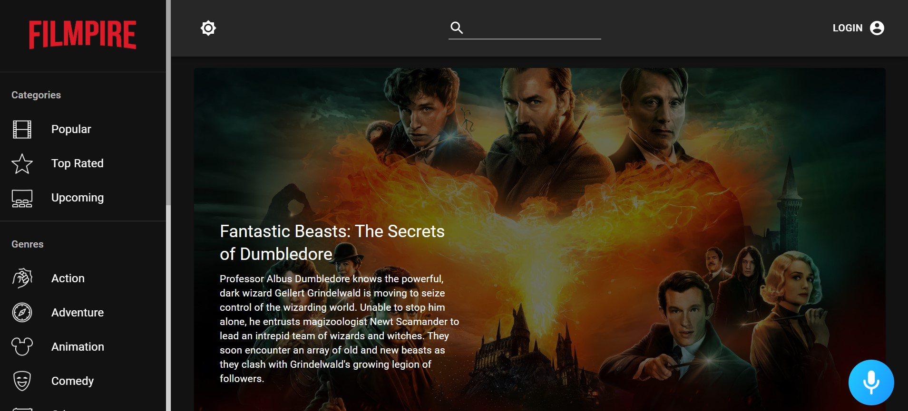

# Filmpire

Filmpire combines the desire to unleash powerful creativity with the industry's most advanced JavaScript tools including React.js, Redux, Material UI, Alan AI, and more.

This application includes user authentication, dark mode, sort movie on the basis of categories or genres, viewing movie and actor details, adding a movie to favorites or watchlist and many more functionalities. 

Alan works as in-app voice assistant which create conversational experiences for filmpire.

Key Achievements:

🎬 **Vast Movie Exploration**: Filmpire is more than just a movie app; it's a gateway to an extensive collection of films spanning diverse categories and genres. Users can effortlessly dive into the world of cinema, discovering hidden gems and all-time favorites.

📜 Advanced Feature Set: Elevating user engagement was paramount. I engineered advanced features including personalized watchlists and genre-specific recommendations, tailoring the experience to individual preferences. This not only enhances user satisfaction but also encourages prolonged interaction.

🎙️ Alan AI Integration: Pushing the boundaries of convenience, I incorporated an innovative voice-controlled assistant named Alan AI. Through Alan AI's intuitive voice commands, users can seamlessly navigate and control the entire application, adding an extra layer of interactivity and accessibility.

🎨 Dynamic UI/UX: By leveraging Material-UI's predefined components, I crafted an interface that effortlessly balances aesthetics with functionality. The application is also equipped with a toggle between light and dark modes, allowing users to tailor their visual experience.

🔍 Intelligent Search: Empowering users to find their ideal movies, I implemented a robust search feature that enables precise exploration based on specific preferences and interests.

🚀 Seamless Navigation: Using React Router DOM, I ensured a smooth and coherent user journey. Users can effortlessly transition between different sections of the application without altering the URL, creating a seamless and intuitive navigation experience.

🔄 Efficient State Management: To maintain a streamlined user experience, I employed Redux for efficient state management, ensuring data consistency and smooth interactions throughout the application.

Tech Stack:

React.js
Node.js
JavaScript
Alan AI
The Movie DB API
Through Filmpire, I've not only showcased my technical prowess but also my commitment to delivering exceptional user experiences. The project exemplifies my ability to innovate, collaborate, and create impactful applications that bridge technology and entertainment.

